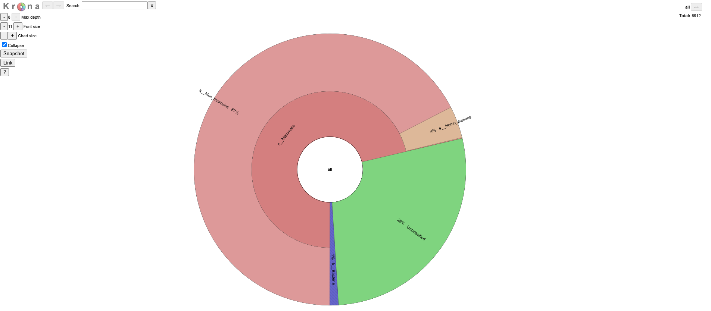

# QC with Kraken2
## Kraken2

### Dependencies
Kraken2 requires quite a large database, so if your working as a group, put this in a shared location. 
100 GB is a good size to expect to use up.
It can be reletively memory intensive so you'll need to factor that in too!

### Install and setup.
A full guide can be found at the [Kraken2 github](https://github.com/DerrickWood/kraken2/blob/master/docs/MANUAL.markdown), but in short...
The easiest way is using conda.
```
conda install -c bioconda kraken2
```
Then you'll need to build the very large library for scanning reads against:
```
mkdir -p $DBNAME && cd $DBNAME
kraken2-build --standard --threads 24 --db $DBNAME
```
But if you want a custom one you'll need to run:
```
kraken2-build --download-taxonomy --db $DBNAME

kraken2-build --download-library bacteria --db $DBNAME
kraken2-build --download-library archaea --db $DBNAME
kraken2-build --download-library viral --db $DBNAME
```
If you want to add custom sequences you can add like this:
```
kraken2-build --add-to-library chr1.fa --db $DBNAME
```
But they need to look like this:
```
>sequence16|kraken:taxid|32630  Adapter sequence
CAAGCAGAAGACGGCATACGAGATCTTCGAGTGACTGGAGTTCCTTGGCACCCGAGAATTCCA
```
You then need to build:
```
kraken2-build --build --db $DBNAME

kraken2-build --clean --db $DBNAME
```

You can then run samples against it:
```
kraken2 --db $DBNAME
        --threads 24
        --report report.txt
        --use-names
        --output output.txt
        --unclassified-out unclassified.fastq
        --classified-out classified.fastq
        input1.fastq input2.fastq > output.kraken
```
## Krona
Krona provides a dynamic viewing of results from Kraken2. 
If you filter down to the most important columns like below:

| Magnitued | NCBI TaxonomicID | Taxonomic Name |
|-----------|------------------|----------------|
| 670       | 1758             | M. musculus    |
| 40        | 9606             | H. sapiens     |
| 280       | 0                | Unclassified   |
| 10        | 2                | {Bacteria}     |


### Install
To install [Krona](https://telatin.github.io/microbiome-bioinformatics/Kraken-to-Krona/), you can type:
```
conda dinstall -c bioconda krona
```
Then you'll need to install the local taxonomic database
```ktUpdateTaxonomy.sh```

### Running Krona
You can genrate a plot of your data now with the command:
```
ktImportTaxonomy -m 1 -o Contam-check.html Kraken2_input.tsv
```

### krakentools
KrakenTools provides scripts to work directly from Kraken2.
The output from Kraken2 looks like this:

| %    | reads | lreads | lvl | tid    | name               |
|------|-------|--------|-----|--------|--------------------|
| 100  | 1000  | 0      | R   | 1      | root               |
| 100  | 1000  | 0      | R1  | 131567 | cellular organisms |
| 100  | 1000  | 50     | D   | 2      | Bacteria           |
| 0.95 | 950   | 0      | P   | 1224   | Proteobacteria     |


You can download from their github the scripts:
```
git clone https://github.com/jenniferlu717/KrakenTools.git
```
You'll need to use python:
```
kreport2krona.py -r report.txt -o krona.tsv
ktImportText krona.tsv -o krona.html
```
You may additionally want to make an MPA-style output that looks like:
```
k__Bacteria|p__Proteobacteria|c__Gammaproteobacteria   95.8
k__Bacteria|p__Firmicutes|c__Bacilli                   4.2
```
To do this run the following:
```
kreport2mpa.py -r report.txt -o mpacount.txt
kreport2mpa.py --percentages -r report.txt -o mpaper.txt
```

## Output
It should genrate a dynamic html like this:
[Example Krona](/docs/additional_scripts/example_krona.html)

Here is a still view of one:



